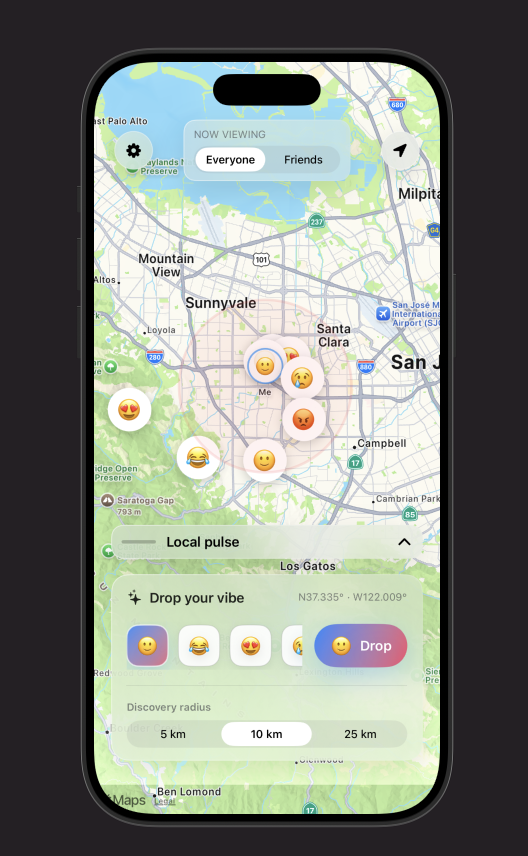

# Ember App

An app to check what's popping around you. Built as part of Stormhacks 2025.

## How to Build Backend
1) Create you own .env file by copying from .env.example.

2) Install Docker and run `docker compose up --build` to start the backend containers.
